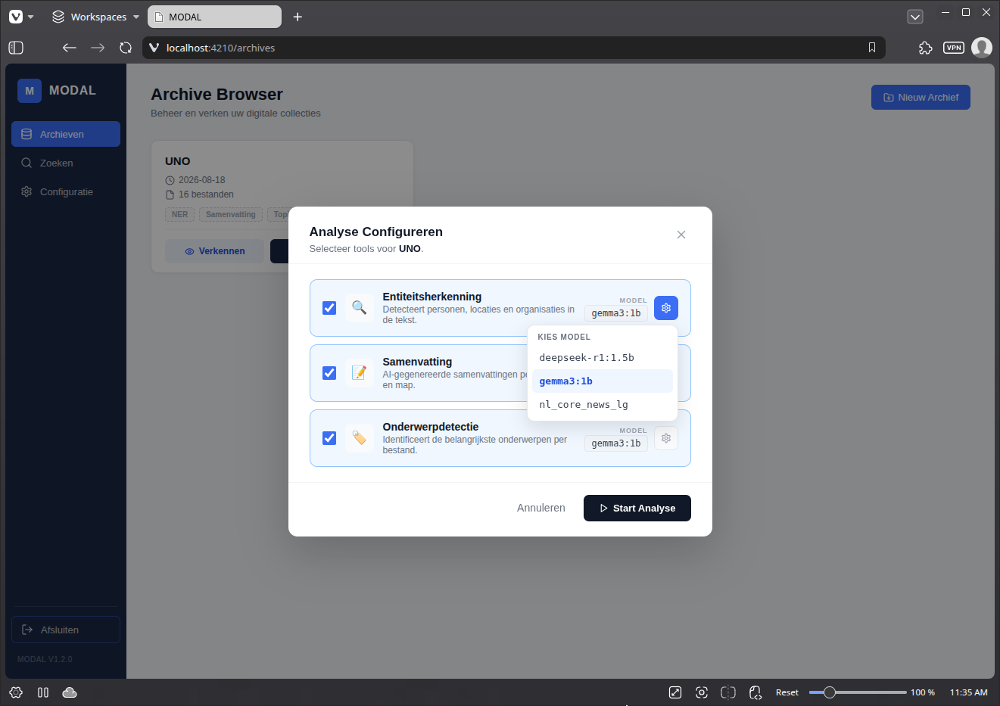

## **AI-Analyses maken**

1. Ga naar het Archievenoverzicht  
2. Klik op 'Analyse starten'  
3. Vink de gewenste analyse aan  
4. Je kan het gebruikte model wijzigen door op het settings-icoon te klikken (bv. gemma3:1b)  
5. Klik 'Start Analyse'

Als de analyse voltooid is, kan je de resultaten bekijken in de [verkenner](verkennen.md)

## Soorten AI-analyse ##

1. **Samenvatting:** 
    * Elk bestand dat tekst bevat wordt samengevat. 
    * Per folder wordt een samenvatting gemaakt van alle documenten in die folder, 
2. **Named Entity recognition (NER)**
    * Herkent namen van: Personen, Organisaties, Plaatsen
    * Vat de belangrijkste entities per folder samen
3. **Topic detection:**
    * Creeert labels (tags) die de inhoud van een document weergeven
    * Geeft per folder de belangrijkste labels 

## Opmerkingen ##

1. De analyses maken gebruik van de eerste 1000 tekens van een document. Je kan dit aanpassen in de [configuratiepagina](configuratie.md)
2. De snelheid van de analyse hangt sterk af van de hardware. 
2. Als je hardware niet geschikt is voor het gekozen model, kan de MODAl app vastlopen.
3. Je kan de default modellen aanpassen in de [configuratiepagina](configuratie.md)