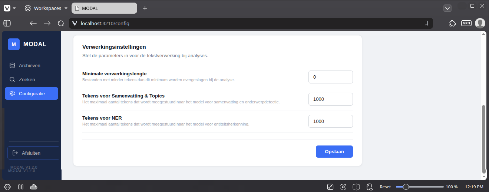

## **Verwerkingsinstellingen** ##

Stel de parameters in voor de tekstverwerking bij analyses:

* **Minimale verwerkingslengte:** 
    * Bestanden met minder tekens dan dit minimum worden overgeslagen bij de analyse. dit zorgt er voor dat er geen analyse wordt uitgevoerd op weinig betekenisvolle bestanden.

* **Tekens voor Samenvatting & Topics:**
    * Het maximaal aantal tekens dat door het AI-model wordt gebruikt voor het maken van samenvattings en onderwerpdetectie.
    * Default: 1000

* **Tekens voor NER:**
    * Het maximaal aantal tekens waarin entiteitsherkenning (NER) wordt uitgevoerd.
    * Default: 1000

## Opmerkingen ##
* Vaak volstaan de eerste zinnen van een document om de inhoud te duiden.
* Hoe groter het gebruikte tekstfragment, hoe langer de analyse duurt. Bij hoge aantallen kan de app vastlopen.
* Als je het maximaal aantal tekens op '0' zet, wordt de volledige tekst gebruikt.
