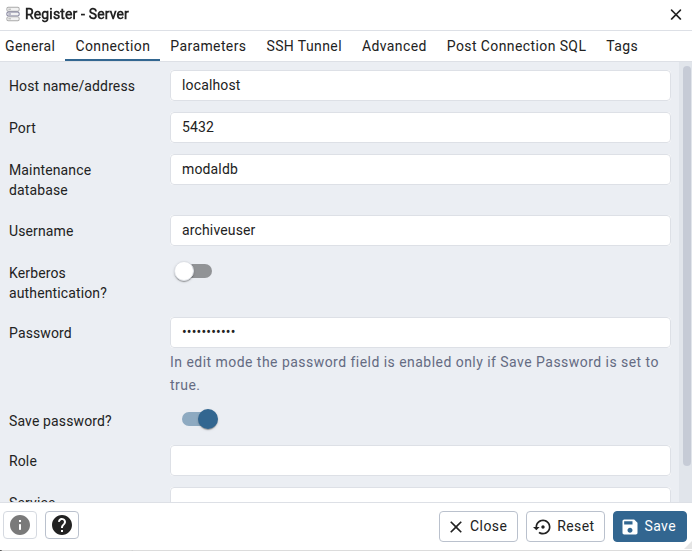

## **PostGresQL integratie**
De MODAL app maakt gebruik van een PostgreSQL database, waarin alle gegevens over bestanden en de resultaten van AI-analyses worden bewaard. 
Hieronder leggen we uit hoe je een rechtstreekse koppeling met de database maakt. 
**Let op!** Door gegevens rechtstreeks in de database aan te passen, is het mogelijk dat gegevens in de MODAL app verdwijnen of niet meer worden getoond. 

De postGresQL database is bereikbaar met volgende credentials:  

        host="localhost",  
        port=5442,  
        database="modaldb",  
        user="archiveuser",  
        password="archivepass"

### **Connectie via pgAdmin**

Een koppeling maken met de PostGresQL database met [pgAdmin](https://www.pgadmin.org/):.

1. Open pgAdmin.  
2. Maak een nieuwe server aan:  
     * Klik met de rechtermuisknop op Servers in het linkermenu (de *Object Explorer*).  
     * Kies Register \> Server....  
     * Geef de verbinding een willekeurige, herkenbare naam (bijvoorbeeld `Docker ModalDB`).  
3. Vul het tabblad 'Connection' in met jouw credentials:  
     * Host name/address: `localhost`  
     * Port: **`5442`**  
     * Maintenance database: `modaldb`  
     * Username: `archiveuser`  
     * Password: `archivepass` (vink *Save password* aan als je dit niet bij elke sessie opnieuw wilt typen).  
4. Verbinden:  
     * Klik rechtsonder op Save.



### **Connectie met Python**

Het is mogelijk de database te bevragen met Python, bv.:

```py
import psycopg2
import pandas as pd

# Connect to database
conn = psycopg2.connect(
    host="localhost",
    port=5432,
    database="modaldb",
    user="archiveuser",
    password="archivepass"
)

# Query data
df = pd.read_sql("SELECT * FROM files", conn)
print(df.head(10))

conn.close()
```
