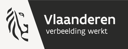

# **Inleiding**

De MODAL tool wordt gebruikt voor het verkennen van born  digital archieven. Hiermee verkrijg je als archivaris inzicht in de vorm en inhoud van het archief: bestandstypes, omvang, taal, onderwerpen, vermelde personen.

Dit inzicht laat toe een oordeel te vormen over de relevantie van het archief en de aanpak voor verwerking.

Concreet ondersteunt  de tool:

* geautomatiseerd verzamelen van gegevens over alle bestanden  
* door middel van AI genereren van metadata  
* visualisatie van de gegevens
* output in een gestructureerd formaat

De tool is *niet* bedoeld als vervanging van archiefbeheersysteem of van een digital repository.

