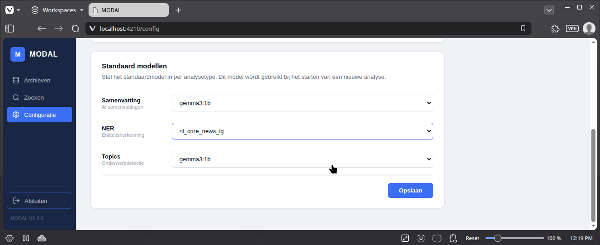

Je kan per soort AI-analyse selecteren welk model default wordt gebruikt.

## **Standaard modellen** ##

De toepassing heeft standaard volgende modellen aan boord:

### **gemma3:1b** ###
[Gemma3:1b](https://ollama.com/library/gemma3:1b) maakt deel uit van de Gemma lichtgewicht modelreeks van Google. De Gemma 3-modellen zijn multimodaal – ze verwerken zowel tekst als afbeeldingen – 
en  ondersteunen meer dan 140 talen. Ze zijn blinken uit in taken zoals vraagbeantwoording, samenvatting en redenering, terwijl hun compacte ontwerp implementatie mogelijk maakt op apparaten met beperkte resources.

### **nl_core_news_lg** ###
[nl_core_news_lg](https://spacy.io/models/nl#nl_core_news_lg) is een Nederlandstalig taalmodel voor spaCy. spaCy is een open-source Python-bibliotheek voor Natural Language Processing (NLP). Het model is bedoeld voor algemene NLP-taken in het Nederlands en ondersteunt onder meer:
Named Entity Recognition (NER) – herkennen van entiteiten zoals personen, organisaties, locaties en datums. Het model is echter een algemeen taalmodel.
 Gebruik dit model als je snel wil werken en/of geen krachtige hardware hebt.

Eventueel kan je zelf [modellen toevoegen](modellen_toevoegen.md)