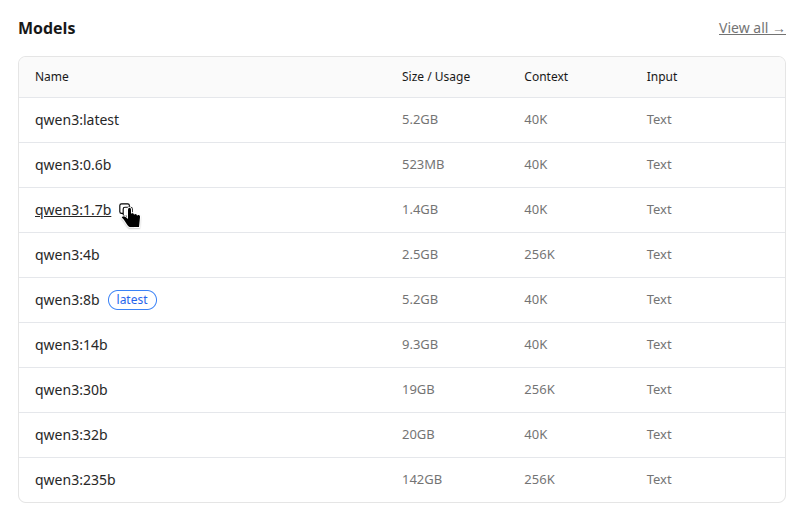
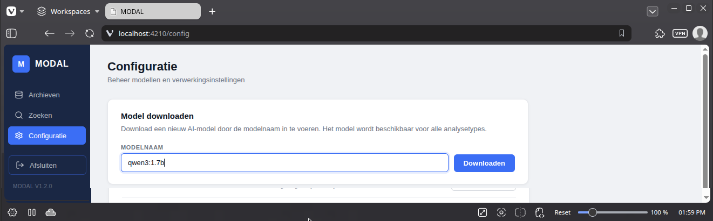

De MODAL app maakt gebruik van Ollama voor het beheren en gebruiken van AI-modellen. 
Dat betekent dat je in principe alle modellen die door Ollama worden ondersteund, kan gebruiken.

Om een model toe te voegen moet je de naam kennen waarmee Ollama het model identificeert. 
Je kan deze modellen opzoeken in de [modellenbibliotheek van Ollama](https://ollama.com/search).

In dit voorbeeld voegen we het model **qwen3** toe.

1. Zoek het model in de [modellenbibliotheek van ollama](https://ollama.com/search?c=thinking&q=qwen3).
2. Ga naar de [detailpagina van het model](https://ollama.com/library/qwen3).
3. Onder **Models** vind je een overzicht met alle versies van het model. Kies een versie die past binnen je hardwareconfiguratie.
4. Kopieer de naam van de gewenste versie, bv. **qwen3:1.7b**.

5. Ga naar de Configuratiepagina van de MODAL app
6. Plak de naam van het model in het vak ''

7. Klik op 'Downloaden'. Het model wordt gedownload en is even later beschikbaar voor AI-analyse.