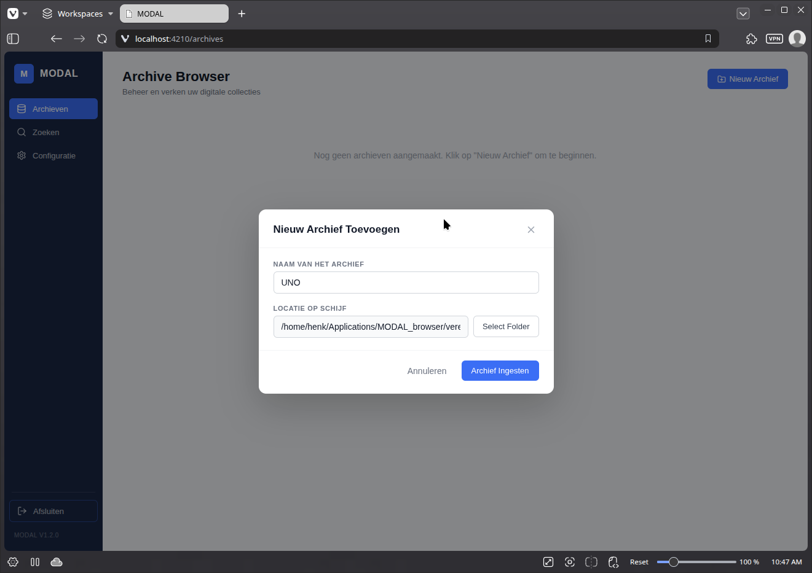
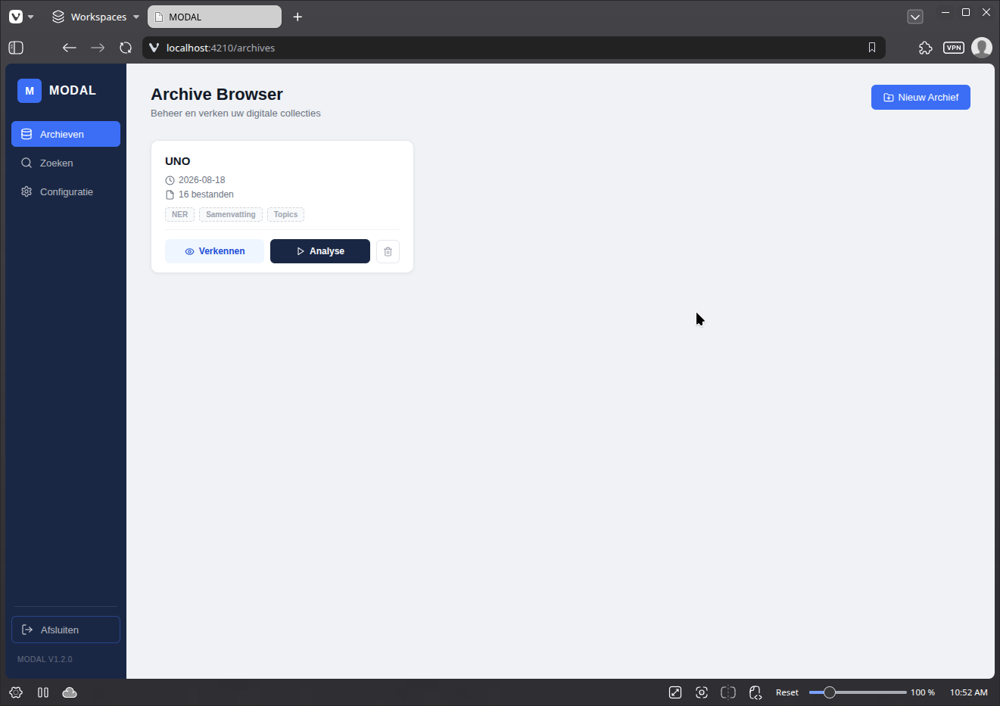
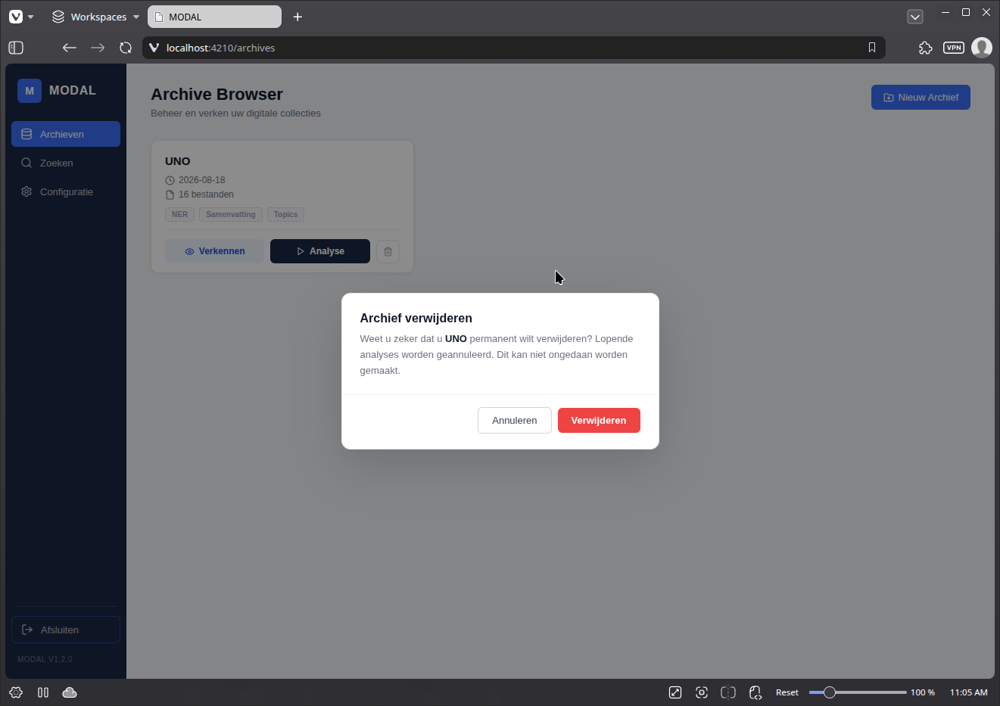

## **Opname archief**

1. Klik op 'Nieuw archief'  (rechts boven)
2. Geef het archief een naam  
3. Klik op 'Select Folder' en blader naar de schijf of map met het archief  
4. Klik op 'Archief Ingesten'. De opname start automatisch.

Tijdens de opname worden de volgende acties uitgevoerd:

* Er wordt een overzicht gemaakt van alle bestanden en de mappenstructuur.
* Van elk bestand wordt het bestandstype bepaald (bv. tekstdocument, spreadsheet…).
* Alle tekst wordt uit de bestanden geëxtraheerd. Bij beeldbestanden (bv. jpg of een gescande pdf) wordt de tekst geëxtraheerd door middel van OCR.

## Opmerkingen ##

* Het opnemen van een archief kan enige tijd duren. Je kan in afwachting andere archieven analyseren of bekijken.
* Je kan een archief slechts eenmaal opnemen.

Als het archief verwerkt is, verschijnt het in het Archievenoverzicht. Je kan nu [verkennen](verkennen.md) of [AI-analyses uitvoeren](analyse)

## **Een archief verwijderen**

Je kan een archief verwijderen door in het Archievenoverzicht op het vuilbakje te klikken en vervolgens het verwijderen te bevestigen.

**Opgelet**: verwijderingen kunnen niet ongedaan worden gemaakt. Alle analyses en andere gegevens gaan verloren.  
