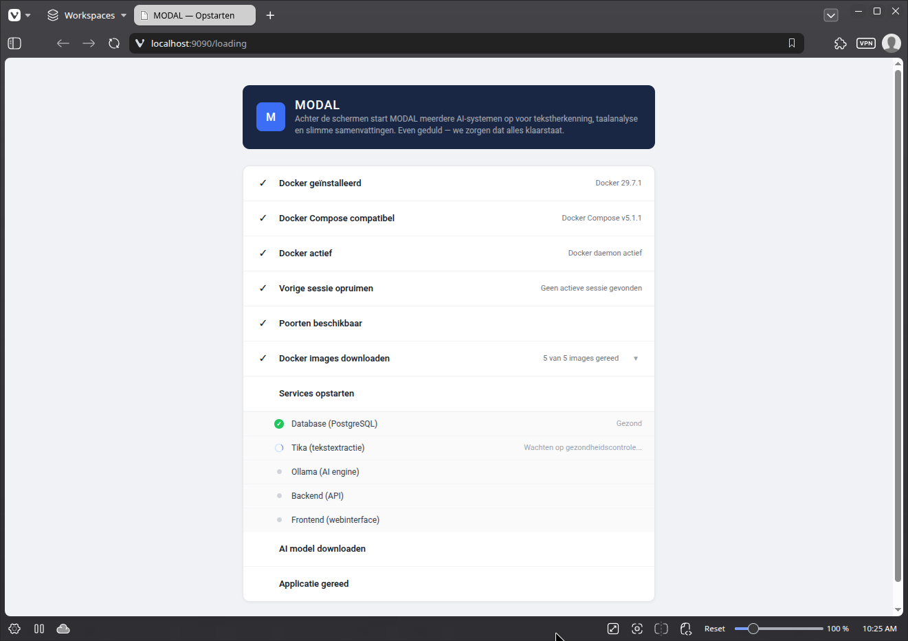
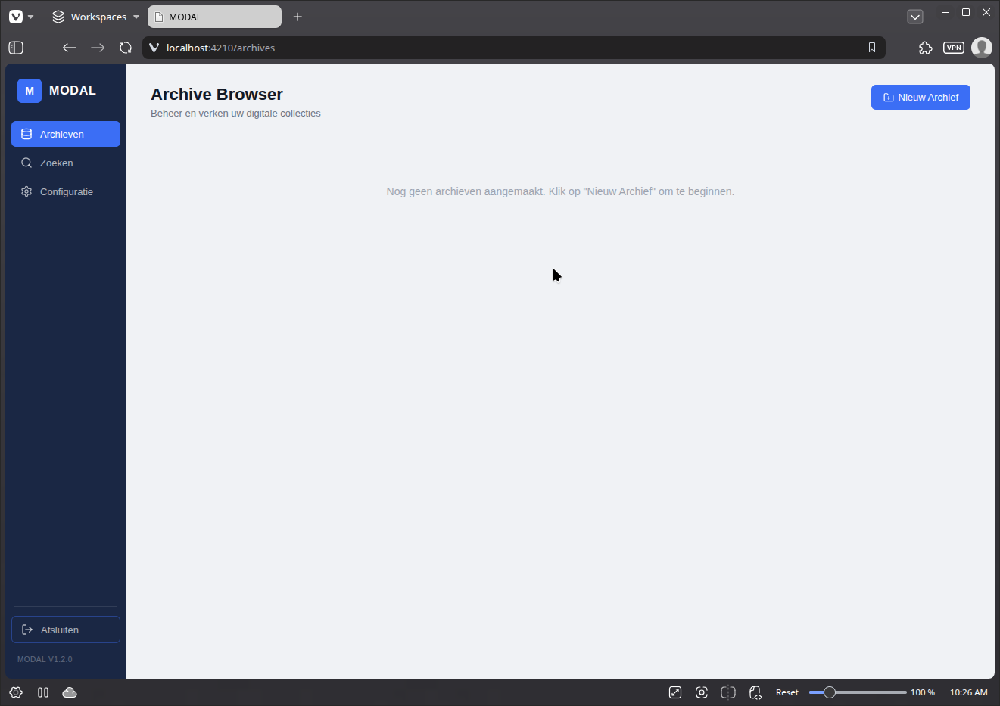
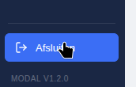

# **Start de applicatie** 

## **Windows** 

### **Start Docker** 

* Zoek naar Docker en selecteer Docker Desktop in de zoekresultaten.  
  * Bij een eerste gebruik toont het Docker-menu de Docker-abonnementsovereenkomst.  
  * Selecteer Accepteren om verder te gaan.   
    Docker Desktop start nadat je de voorwaarden hebt geaccepteerd.

### **Start de MODAL app** 

* ga naar de folder `archive-app-windows`   
* dubbelklik op het bestand `archive-agent.exe`   
* de applicatie opent in je default browser

## **macOS** 

### **Start Docker** 


### **Start de MODAL app** 

* ga naar de folder `archive-app-macos-arm64`   
* dubbelklik op het bestand `archive-agent`   
* de applicatie opent in je default browser


## **Linux** 

### **Start Docker** 

* controleer of Docker actief is, bv. met 

```shell
docker ps
```

* Als Docker niet actief is, start dan op met:

```shell
systemctl start docker
```

### **Start de MODAL app** 

* ga naar de folder `archive-app-linux`  
* dubbelklik op het bestand `archive-agent`  
* de applicatie opent in je default browser. Je krijgt een scherm te zien waarin je het opstartproces kan volgen. Bij een eerste opstart kan dit even duren.  


<figcaption>Het MODAL opstartscherm toont de status van alle componenten</figcaption>

* Wanneer het opstartproces voltooid is, verschijnt het MODAL archievenoverzicht



## **De applicatie stoppen**

Je kan de applicatie afsluiten met  op de knop 'Afsluiten' links onderaan.  
