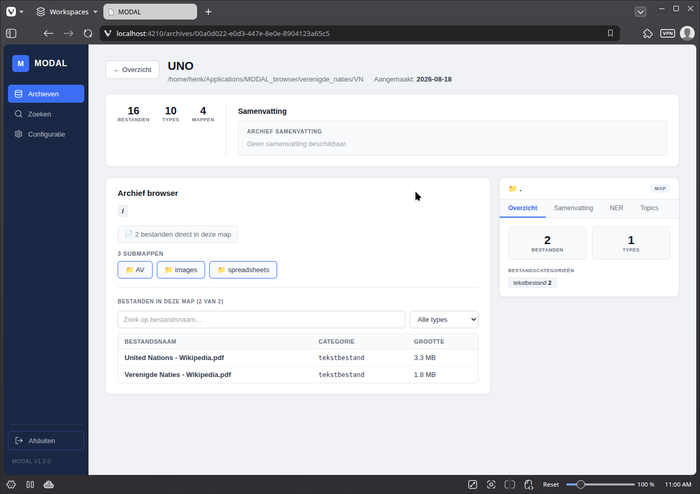

## **Verkennen**

Na opname kan je de inhoud van het archief verkennen:

1. Klik op de knop 'Verkennen'.  
2. Klik op een subfolder om de inhoud van een folder te bekijken.
3. Klik op een bestand om de gegevens van een bestand te bekijken.
3. Klik op de tabs om de resultaten van [AI analyes](analyse.md) te zien.

